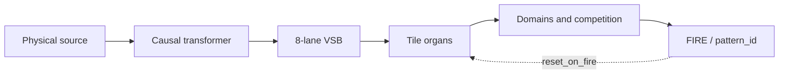
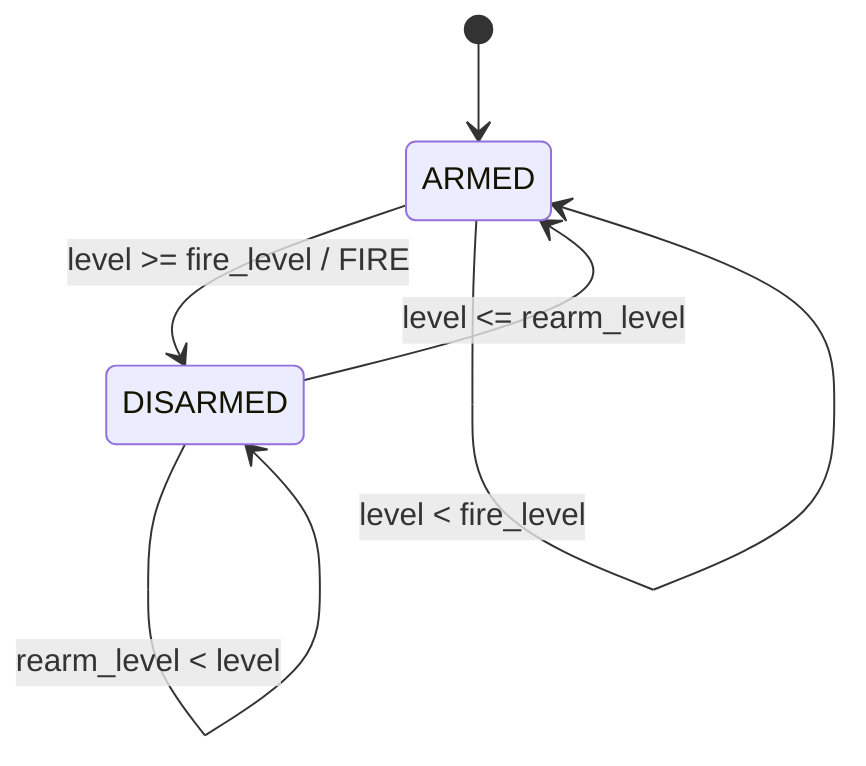
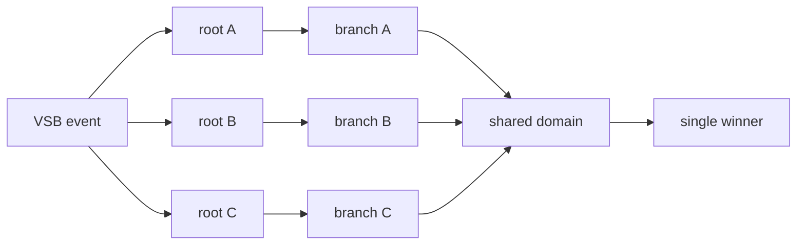

# Personality architecture patterns

A Decima-8 personality is built from stable combinations of an input
alphabet, tile parameters, the local permission graph, domains, and reset
rules. An architect uses these combinations as reusable building blocks.

Here, a pattern means a recurring organ design, not a recognized object or a
`pattern_id`.



## Pattern card

Before baking an organ, record its purpose, input units, excitation, decay,
FIRE corridor, rearm condition, reset scope, and invariants. Numeric thresholds
lose their physical meaning when this contract is missing.

## Leaky integrator

An unlocked tile is already a memory organ:

```text
state <- decay_toward_zero(state + W x VSB)
```

Strong or repeated impulses accumulate while sparse traces disappear. The
memory horizon follows jointly from weights, `decay16`, and the latch
corridor.

## Corridor detector

A tile fires when its signed accumulator enters a corridor:

```text
thr_lo16 <= state <= thr_hi16
```

The upper boundary distinguishes an expected impact from overload. Both
boundaries must be verified against the real range of the input alphabet.

## Hysteretic threshold

A continuous level oscillating around a single threshold produces event
chatter. An event organ therefore uses separate FIRE and rearm levels:

```text
ARMED:
  level >= fire_level  -> FIRE, become DISARMED

DISARMED:
  level <= rearm_level -> become ARMED

rearm_level < fire_level
```

This is the hydraulic equivalent of a Schmitt trigger. It is not a timer-based
debounce: one complete excursion produces one event.



The pattern may live in the Conductor input organ or in an antagonistic tile
group. If it is applied before VSB, its units, thresholds, and alphabet version
belong in the personality manifest alongside the `.d8p`.

## Sequence chain

A local edge grants permission to compute; it does not carry data. A chain
therefore recognizes an ordered evolution:

```text
condition A -> enable B on the next tick -> condition B -> enable C
```

Every node observes a new frame of the common VSB.

## Parallel fan-out

Independent hypotheses must not share a serialized trunk. A short impulse may
open only the nearest branches and leave the rest of the catalogue physically
unreachable.

Each alternative needs an independent permission path:



The baker must test every declared route in the real runtime, not only inspect
the `.d8p` structure.

## Convergence and domain competition

Final tiles from alternative explanations may share a domain. Priorities
resolve collisions deterministically, one `pattern_id` is emitted, and
`reset_on_fire_mask16` may clear the consumed memory.

Domain competition selects among reachable explanations. It cannot repair a
missing evidence path.

## Scale matching

The same personality can observe different sources only after their physical
ranges have been matched to VSB. Level `15` must represent comparable impact,
not an accidental maximum in one file.

Each input contour records source units, deadband, Level16 full scale, FIRE and
rearm levels, causal window, and transformer version. Gain may differ between
sources, but it remains frozen inside a verifiable contour.

## Required verification

1. Equal input and initial state produce a byte-identical trace.
2. Every declared path can reach its FIRE.
3. A sustained level above threshold does not repeat crossing events.
4. Returning only into the hysteresis band does not rearm the organ.
5. Returning below `rearm_level` enables the next event.
6. An alternative root does not depend on a neighbouring branch length.
7. Reset clears only declared domains.
8. Input scale is recorded and reproduced without future data.

These checks belong to personality physics. An application director may
interpret valid events, but it cannot repair a deaf, saturated, or unreachable
organ.
