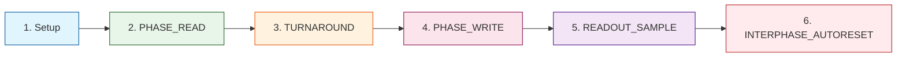

# READ / WRITE Phases

> **Two-phase guard: deterministic rhythm of Decima-8**

---

## 🔄 Canonical Tick (EV_FLASH)



---

## 1️⃣ Setup (Conductor)

### Actions

```
Conductor sets VSB_INGRESS16[0..7] (Level16)
Holds stable until end of READ aperture
```

### Requirements

| Requirement | Description |
|-------------|-------------|
| **Stability** | Data doesn't change during READ |
| **Range** | Level16: 0..15 on each lane |
| **All 8 lanes** | No per-lane masks |

---

## 2️⃣ PHASE_READ (Island)

### Start of READ

```python
# Snapshot locked for all tiles
locked_before[t] = locked[t]

# Compute ACTIVE closure (least fixed point)
ACTIVE[t] = compute from activation graph

# If ACTIVE[t] == 0 → forced reset
if ACTIVE[t] == 0:
  thr_cur16[t] := 0
  locked[t] := 0
  drive_vec[t] := {0..0}
  # weights/row/decay not applied
```

### For ACTIVE[t] == 1

#### Input Read

```python
for i in 0..7:
  in16[t][i] = clamp15(VSB_INGRESS16[i])
  IN_CLIP[t][i] = (VSB_INGRESS16[i] > 15)
```

#### If locked_before == 0

```python
# 1. Row-pipeline (for each row r=0..7)
row_raw_signed[r] = Σ_{i=0..7} (in16[i] * Wmag[r][i] * sign)
row16_out[r] = clamp15((max(row_raw_signed[r], 0) + 7) / 8)
row16_signed[r] = row_raw_signed[r]

# 2. Accumulator + decay
delta_raw = Σ_{r=0..7} row16_signed[r]
thr_tmp = thr_cur16 + delta_raw

# Decay to 0 (doesn't jump over)
if decay16 > 0:
  if thr_tmp > 0: thr_tmp = max(thr_tmp - decay16, 0)
  elif thr_tmp < 0: thr_tmp = min(thr_tmp + decay16, 0)

thr_cur16 = clamp_range(thr_tmp, -32768, 32767)

# 3. Fuse by range
in_range = (thr_lo16 <= thr_cur16 <= thr_hi16) AND (thr_lo16 < thr_hi16)
has_signal = (delta_raw != 0)
entered_by_decay = (decay16 > 0) AND (in_range) AND (!in_range_before_decay)

locked_after = (BAKE_APPLIED == 1) AND in_range AND (has_signal OR entered_by_decay)
```

#### If locked_before == 1

```python
locked_after := 1
# thr_cur16 doesn't change, matrix/decay not applied
```

#### Drive Vector Selection

```python
if locked_after == 1:
  drive_vec[i] = in16[i]  # passthrough
else:
  drive_vec[i] = row16_out[i]
```

---

## 3️⃣ TURNAROUND

### Direction Change

```
Conductor: removes VSB drive (Hi-Z / no-drive)
Island: enables BUS16 drive
```

> **Important:** Turnaround (direction gap) is required so Conductor releases VSB and Island can drive it.

---

## 4️⃣ PHASE_WRITE (Island)

### Write Conditions

Tile writes to BUS16 only if:

```
BUS_W == 1 AND (locked self OR locked_ancestor)
```

### Write

```python
# Write entire drive_vec[0..7] (all 8 lanes)
for t where BUS_W[t]==1 and (locked[t] or locked_ancestor[t]):
  contrib += drive_vec[t]

# Honest summing
for i in 0..7:
  BUS16[i] = clamp15(contrib[i])
  BUS_CLIP[i] = (contrib[i] > 15)
```

---

## 5️⃣ READOUT_SAMPLE (Conductor)

### Default R0_RAW_BUS

```python
R0_RAW_BUS: readout = BUS16[0..7] as 8×Level16
```

### Timing

```
Conductor reads BUS16 immediately after PHASE_WRITE completes

In SHM: EV_FLASH fills OUT_buf
Conductor reads after call returns
```

---

## 6️⃣ INTERPHASE_AUTORESET (Optional)

### AutoReset-by-Fire

Applied after readout and FLAGS32_LAST are latched:

```python
# Compute auto-reset mask
AUTO_RESET_MASK16 = OR_{d | cnt(d)>0} reset_on_fire_mask16[winner(d)]

# Apply
apply_reset_domain(AUTO_RESET_MASK16)
```

### Effect

```
For domains in mask:
  thr_cur16 := 0
  locked := 0

# Except the resetting tile and its ancestor chain
```

---

## ⏱️ Timing (Reference)

| Phase | Duration |
|-------|----------|
| **READ** | ~10µs |
| **TURNAROUND** | ~2µs |
| **WRITE** | ~8µs |
| **READOUT** | ~1µs |
| **AUTORESET** | ~1µs |
| **Total** | **~22µs** |

> **Note:** Timing depends on implementation (emulator/PCB/FPGA/ASIC).

---

## 🚫 Constraints

| Constraint | Description |
|------------|-------------|
| **EV_RESET_DOMAIN** | Only between EV_FLASH |
| **EV_BAKE** | Only between EV_FLASH |
| **BAKE_APPLIED** | EV_FLASH allowed only if BAKE_APPLIED==1 |
| **No baked changes** | Baked parameters don't change inside EV_FLASH |

---

## 📊 FLAGS32 (Runtime)

Island returns FLAGS32 (minimum):

| Bit | Flag | Description |
|-----|------|-------------|
| **bit0** | READY_LAST | Last cycle completed |
| **bit1** | OVF_ANY_LAST | Overflow in last cycle |
| **bit2** | COLLIDE_ANY_LAST | Collision in last cycle |

---

**Bake the Future. Build the Substrate.** 🛠️⚡️
