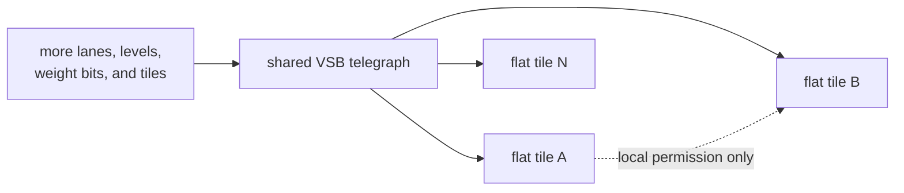

# Tile model v3

A tile is a local hydraulic integrator over the shared eight-lane VSB. It neither receives a neighbour's output nor forwards its own data to a neighbour.

## What the architect bakes

| Field | Role |
| --- | --- |
| `W[8][8]` | Signed transform of the common VSB input |
| `thr_lo16`, `thr_hi16` | Latching corridor |
| `decay16` | Accumulator leakage toward zero |
| `routing_flags16` | Local permission edges, `BUS_R`, `BUS_W` |
| `domain_id4` | Competition and reset domain |
| `priority8` | Winner selection inside a domain |
| `pattern_id16` | Event identifier |
| `reset_on_fire_mask16` | Domains reset by the winner |

Runtime state primarily consists of the signed `thr_cur16` accumulator and the `locked` latch.

## Common input

Every ACTIVE tile receives the same frame:

```c
in16[t][lane] = clamp15(VSB_INGRESS16[lane]);
```

The tile matrix does not deliver data. It defines that tile's sensitivity to the eight strings of the common stream.

## Scaling boundary

Eight lanes, Level16, and the current weight and threshold widths are deliberate choices. They define the working point of DECIMA-8, not a claim that every future machine must keep exactly the same dimensions.

The architecture permits parametric expansion:

- more lanes on the shared VSB;
- more distinguishable levels per lane;
- wider weights, thresholds, and accumulators;
- more tiles and domains.

These changes increase machine width and resolution while preserving its central contract: one common telegraph presents the current frame to every ACTIVE tile, each tile owns only local state, and neighbour edges carry permission to compute rather than values.



**A deep tile is not parametric scaling.** Once the minimal tile contains hidden layers, a private value path, or a sequence of internal compute nodes, it becomes a small network. Complexity moves from the composition of simple elements in a common medium into the element itself, changing tile atomicity, causality, and the role of the personality architect.

Such a variant can be researched, but it requires a separate architectural contract and is not merely a larger DECIMA-8. Hierarchy is cleaner when built from explicitly separated flat contours instead of hiding another network inside the base tile.

The physical substrate does not define this boundary. SRAM, register logic, or a future memristive implementation can host Decima as long as they preserve the common telegraph and the simple local-integrator model.

## Accumulation

For an unlocked tile:

```text
delta = sum(W x VSB)
thr_cur = clamp_i16(decay_toward_zero(thr_cur + delta))
```

When the new state enters the active `[thr_lo16..thr_hi16]` corridor, the tile may latch. The `unlocked -> locked` transition is the `FIRE` event.

The upper bound is a real part of the filter. Both insufficient and excessive accumulated impact are outside the corridor, while the meaning of that distinction belongs to the baker, not the machine.

## Life of a locked tile

A locked tile:

- adds no new `delta`;
- continues to decay toward zero;
- remains locked only while the accumulator is inside its corridor and activation permission remains;
- unlocks on corridor exit or permission loss;
- recomputes `row_out` from the current common VSB for a possible BUS16 contribution.

Lock is therefore neither permanent state nor input passthrough. It is a leaky, temporarily retained state.

## Emergent memory

The sequence is not stored in a separate buffer. It appears in:

1. accumulated `thr_cur` values;
2. current latches;
3. the permitted topology front;
4. domain FIRE and reset events.

The baker constructs a memory organ from a sparse set of tiles, and the tape fills it with state.

## Invariants

- the same `.d8p`, initial state, complete VSB tape, and reset schedule produce the same trace;
- `FIRE` means only a transition into lock;
- an inactive tile clears its runtime state;
- neighbour edges carry no data.
