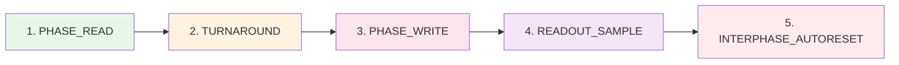

# Protocol v0.2

> **Event Protocol / SHM ABI / UDP**

---

## 📡 External Events (API)

### EV_FLASH(tag_u32)

| Parameter | Description |
|-----------|-------------|
| **Purpose** | One deterministic READ→WRITE cycle |
| **Return** | readout (R0/R1), FLAGS read separately |
| **Condition** | Allowed only if BAKE_APPLIED==1 |

```python
if BAKE_APPLIED == 0:
  return NotBaked  # state unchanged

# Executes PHASE_READ → TURNAROUND → PHASE_WRITE → READOUT_SAMPLE
# Fills OUT_buf
return readout, FLAGS32
```

---

### EV_RESET_DOMAIN(mask16)

| Parameter | Description |
|-----------|-------------|
| **Purpose** | Domain reset (thr_cur16=0, locked=0) |
| **Condition** | Only between EV_FLASH |
| **Condition** | Only if BAKE_APPLIED==1 |

```python
if BAKE_APPLIED == 0:
  return NotBaked

for tile in tiles:
  if (mask16 >> domain_id4[tile]) & 1:
    thr_cur16[tile] := 0
    locked[tile] := 0
```

---

### EV_BAKE()

| Parameter | Description |
|-----------|-------------|
| **Purpose** | Apply staging BakeBlob atomically |
| **Condition** | Only between EV_FLASH |
| **Effect** | Does runtime reset after apply |

```python
if BAKE_APPLIED == 0:
  return NotBaked

# Apply staging BakeBlob atomically
if validation_error:
  return error  # nothing changed

# On success:
reset_runtime()  # thr_cur16=0, locked=0 for all
BAKE_APPLIED := 1
```

---

## 🔄 Internal Sub-phases of EV_FLASH



| Sub-phase | Description |
|-----------|-------------|
| **PHASE_READ** | Tiles sample input, update runtime |
| **TURNAROUND** | Conductor: Hi-Z, Island: prepare drive |
| **PHASE_WRITE** | Island drives BUS16 |
| **READOUT_SAMPLE** | Conductor reads BUS16 |
| **INTERPHASE_AUTORESET** | Optional domain reset |

---

## 📊 Readout Timing

### Default R0_RAW_BUS

```
Conductor reads BUS16[0..7] immediately after PHASE_WRITE completes

In SHM: EV_FLASH fills OUT_buf
Conductor reads after call returns
```

### Readout Format

```
readout = BUS16[0..7] as 8×Level16
```

---

## 🚨 EV_BAKE Errors

| Error | Code | Description |
|-------|------|-------------|
| **OK** | 0 | Success |
| **BakeBadMagic** | 1 | Wrong magic |
| **BakeBadVersion** | 2 | Wrong version |
| **BakeBadLen** | 3 | Wrong length |
| **BakeMissingTLV** | 4 | Missing required TLV |
| **BakeBadTLVLen** | 5 | Wrong TLV length |
| **BakeCRCFail** | 6 | CRC error |
| **BakeReservedNonZero** | 7 | Reserved fields non-zero |
| **TopologyMismatch** | 8 | Topology mismatch |
| **BakeNoBlob** | 9 | Blob missing |

---

## 🎛️ Runtime FLAGS32

Island returns FLAGS32 (minimum):

| Bit | Flag | Description |
|-----|------|-------------|
| **bit0** | READY_LAST | Last cycle completed |
| **bit1** | OVF_ANY_LAST | Overflow in last cycle |
| **bit2** | COLLIDE_ANY_LAST | Collision in last cycle |

---

## 🌐 UDP Protocol (packet_v1)

> **Machine cascading**

### Packet Format (37 bytes)

| Offset | Field | Type | Description |
|--------|-------|------|-------------|
| **0** | magic | u32 | 'D8UP' (0x50553844) |
| **4** | version | u16 | 1 |
| **6** | flags | u16 | has_winner, has_bus, has_cycle, has_flags |
| **8** | frame_tag | u32 | Frame tag |
| **12** | domain_id | u8 | Domain ID |
| **13** | pattern_id | u16 | Pattern ID |
| **15** | reset_mask16 | u16 | Reset mask |
| **17** | collision_mask16 | u16 | Collision mask |
| **19** | winner_tile_id | u16 | Winner ID |
| **21** | cycle_time_us | u32 | Cycle time |
| **25** | flags32_last | u32 | Last cycle FLAGS |
| **29** | bus16[8] | u8×8 | Bus values |

### Flags (u16)

| Bit | Flag | Description |
|-----|------|-------------|
| **bit0** | has_winner | winner_tile_id/pattern_id valid |
| **bit1** | has_bus | bus16[8] valid |
| **bit2** | has_cycle | cycle_time_us valid |
| **bit3** | has_flags | flags32_last valid |

### Notes

```
reset_mask16 sets domains for RESET_DOMAIN
collision_mask16/winner_tile_id/pattern_id valid if flags has_winner
bus16 valid if flags has_bus
cycle_time_us valid if flags has_cycle
flags32_last valid if flags has_flags
```

---

## 🎯 COLLIDE: Domains and Winner

### Definitions

```
FIRE(t) = (locked_before[t]==0 && locked_after[t]==1)
FIRED_SET(d) = { t | domain_id(t)=d && FIRE(t)=1 }
cnt(d) = |FIRED_SET(d)|
```

### Rules

| cnt(d) | Winner | COLLIDE(d) |
|--------|--------|------------|
| **0** | none | 0 |
| **1** | single | 0 |
| **≥2** | selected | 1 |

### Winner Selection (when cnt≥2)

```
1. max priority8
2. on tie min tile_id

winner(d) = argmax_{t∈FIRED_SET(d)} (priority8(t), -tile_id(t))
```

---

## 🔄 AutoReset-by-Fire

### Auto-Reset Mask

```python
AUTO_RESET_MASK16 = OR_{d | cnt(d)>0} reset_on_fire_mask16[winner(d)]
```

### Application

```
Applied strictly after READOUT_SAMPLE of current EV_FLASH

apply_reset_domain(AUTO_RESET_MASK16)

Effect: as 6.3 for domains in mask, EXCEPT:
- resetting tile
- its entire ancestor chain
```

---

## 📐 Readout Policy

### Default: R0_RAW_BUS

```
mode = 0
readout = BUS16[0..7]
```

### Optional: R1_DOMAIN_WINNER_ID32

```
mode = 1
readout = winner_tile_id (requires discipline "only winner drives ID")
```

> **Note:** R1 requires that only winner drives ID, otherwise sum destroys ID.

---

## 📋 Bake Transaction / CFG Staging

### Staging Buffer

```
CFG_CS, CFG_SCLK, CFG_MOSI, CFG_MISO

Via CFG:
- load BakeBlob to staging
- read FLAGS
- command EV_RESET_DOMAIN(mask16)
- (optional) read BAKE_ID_ACTIVE / PROFILE_ID_ACTIVE
```

---

**Bake the Future. Build the Substrate.** 🛠️⚡️
