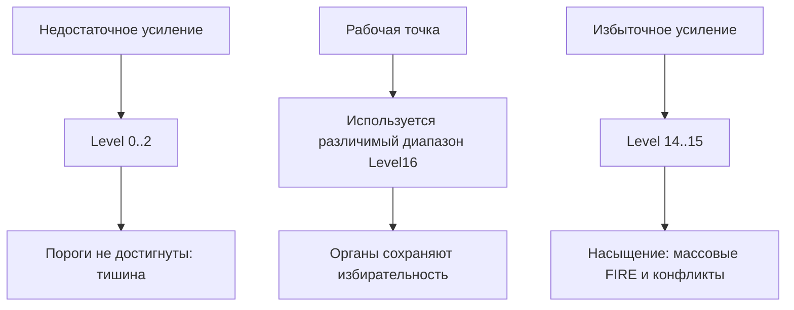
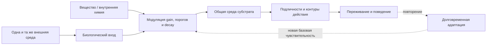

# AGC и рабочая точка личности

Тайлы Decima используют абсолютные веса, signed-аккумуляторы и коридоры
фиксации. Поэтому одной правильной семантики восьми линий недостаточно:
амплитуда VSB должна попадать в диапазон, для которого была выпечена личность.

Если воздействие слишком слабое, нужные интеграторы не доходят до своих
коридоров и swarm молчит. Если оно слишком сильное, множество органов
одновременно насыщается и теряет избирательность. Между этими режимами
находится **рабочая точка личности**.

AGC, automatic gain control или автоматическая регулировка усиления, удерживает
вход около этой точки.


AGC расположен **до swarm**. Директор после события способен решить, что делать
с FIRE, но не способен восстановить событие, которое глухая личность не
выдала.

## Три разных слоя

Нормализацию, AGC и личность нельзя смешивать.

| Слой | Вопрос | Что он меняет |
| --- | --- | --- |
| Нормализация | Что физически означает линия и уровень? | Единицы, знак, deadband, базовый full scale |
| AGC | В какой части этого диапазона сейчас работает источник? | Коэффициент усиления или выбранную полку масштаба |
| Личность | На какие сочетания и историю реагировать? | Веса, decay, коридоры, граф, домены и reset |

Нормализация делает разные записи одного физического явления сопоставимыми.
AGC согласует текущий динамический диапазон с абсолютной чувствительностью
тайлов. `.d8p` определяет, какие события внутри согласованной ленты имеют смысл.

AGC не является обучением личности и не должен знать правильный будущий ответ.
Он регулирует допуск сигнала к уже выпеченной ткани.

## Почему статического full scale недостаточно

Статический коэффициент достаточен, пока источник живёт в одном диапазоне.
Реальный поток может менять масштаб на порядок, не меняя своей природы:

- громкость одного и того же звука зависит от расстояния;
- вибрация зависит от режима механизма;
- рыночная микроструктура проходит через спокойные и импульсные режимы;
- биологический субстрат меняет чувствительность под действием внутренней
  химии и состояния тела.

При одном fixed scale тихий режим остаётся на Level 0..2, а сильный упирается в
Level 14..15. Одна и та же личность сначала глохнет, затем перевозбуждается.



AGC не обязан быть одним плавным множителем. Допустимы:

- общий gain для всех восьми линий;
- банк заранее зафиксированных полок масштаба;
- отдельные gain по линиям, если отношения между линиями не являются частью
  семантики;
- выбор полки медленным контекстом;
- обратная связь по прошлой насыщенности входа или плотности FIRE.

Общий gain лучше сохраняет геометрию восьмилинейного вектора. Независимые gain
по линиям сильнее искажают его, поэтому являются частью версии входного
алфавита и требуют отдельной проверки личности.

## Причинный AGC

Регулятор остаётся частью детерминированной машины только при строгом
контракте:

1. Используются текущие и прошлые данные, но не будущее.
2. Gain ограничен диапазоном `gain_min..gain_max`.
3. Скорость изменения ограничена attack/release или переходами между
   фиксированными полками.
4. Регулятор меняется медленнее события, которое должна различать личность.
5. Начальное состояние и warmup воспроизводимы.
6. Состояние AGC пишется в trace рядом с состоянием источника и swarm.
7. Одинаковые вход, manifest и начальное состояние дают byte-identical VSB и
   событийный след.

Упрощённая причинная схема может выглядеть так:

```text
level_t = causal_level(x_0 .. x_t)
target_gain_t = target_level / max(level_t, epsilon)
gain_t = bounded_attack_release(gain_(t-1), target_gain_t)
VSB_t = clamp15(quantize(gain_t * normalized_x_t))
```

Конкретная формула не является инвариантом Decima. Инвариантами являются
причинность, ограниченность, версионирование и воспроизводимость.

Слишком быстрый AGC опасен: он начинает следовать за каждым импульсом и стирает
амплитуду самого события. Такой регулятор превращает сильный удар и обычный шум
в одинаковые Level16. Для гидравлической личности gain должен двигать рабочую
точку, а не выравнивать каждую волну.

## AGC как часть исполняемого контура

Для строгого replay недостаточно сохранить `.d8p` и VSB-файл, если VSB
создаётся динамическим регулятором. Manifest контура фиксирует:

- версию исходного преобразователя;
- физические единицы и базовый full scale;
- тип AGC: общий, по линиям или банк полок;
- целевую рабочую область;
- `gain_min`, `gain_max`, attack и release;
- частоту обновления;
- начальное состояние и источник warmup;
- используемую обратную связь;
- версию личности, для которой выполнена юстировка.

Состояние AGC является runtime-памятью наравне с аккумуляторами тайлов. После
рестарта его либо догревают причинной историей, либо честно ждут накопления
контекста. Иначе live и replay начинают с разных рабочих точек.

## Что контролировать

AGC проверяется не итоговым PnL или accuracy, а физическими метриками:

- доля кадров в Level 0..2 и Level 13..15;
- число и длительность состояний полной тишины;
- насыщение BUS16 и `BUS_CLIP`;
- плотность FIRE по органам и доменам;
- распределение выбранных gain или полок;
- число переключений полки;
- совпадение VSB, FIRE и BUS16 между live и replay;
- устойчивость результата к соседним допустимым значениям параметров.

Последний пункт отличает рабочую область от случайно найденной точки. Если
небольшое изменение gain полностью меняет каталог событий, контур ещё не
юстирован.

## Типовые ошибки

| Ошибка | Наблюдаемое поведение |
| --- | --- |
| AGC отсутствует | Месяцы тишины сменяются перевозбуждением |
| AGC стоит после swarm | Пропущенные FIRE невозможно восстановить |
| Attack слишком быстрый | Регулятор съедает амплитуду события |
| Gain не ограничен | Выброс перестраивает чувствительность всего контура |
| Используется будущее окно | Replay получает скрытую утечку будущего |
| Состояние не сохраняется | Перезапуск меняет события при той же ленте |
| Пер-линейный gain не версионирован | Меняется геометрия VSB и фактически сама личность |

## Вещество как AGC зависимого субстрата

Для биологического субстрата это архитектурная гипотеза, а не буквальное
описание нейрохимии и не медицинская модель.

Вещество можно представить не как сообщение на общей шине, а как
**регулятор допуска сообщений к личности**. Оно способно менять чувствительность
рецепторов, баланс возбуждения и торможения, пороги реакции, decay и длительность
удержания состояния. Тогда прежняя внешняя среда предъявляется той же
распределённой личности с другим эффективным gain.



Такое различение объясняет важную возможность: вещество не обязано нести
содержание переживания. Оно может менять, **какое содержание вообще достигает
коридоров реакции**. Слабые ключи становятся обязательными, обычный фон —
значимым, а альтернативные контуры могут перестать получать право на действие.

Острое воздействие и зависимость при этом не тождественны:

- острое воздействие похоже на временный сдвиг рабочей точки;
- повторение запускает адаптацию субстрата;
- адаптация меняет базовую чувствительность, торможение и ожидаемый уровень;
- без вещества обычный вход может оказаться ниже новой рабочей области;
- вещество временно возвращает или превышает привычный режим усиления.

На этом этапе меняется уже не только внешний AGC. Долговременная пластичность
становится частью эффективной личности субстрата. Поэтому формула «личность та
же, изменился только gain» допустима для краткого архитектурного среза, но
недостаточна для хронического процесса.

Развёрнутая философская модель повторного проживания состояния находится в
[тексте о зависимости и любви](https://philo.rulerom.com/ru/world/addict/).

## Главный вывод

Пекарь проектирует чувствительность личности, но источник не обязан всю жизнь
оставаться в масштабе выпечки. Между физическим потоком и swarm нужен
проверяемый контур согласования рабочей точки.

AGC не делает Decima умнее и не выбирает правильный ответ. Он позволяет
личности оставаться самой собой в меняющемся динамическом диапазоне.
