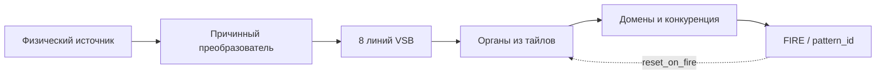
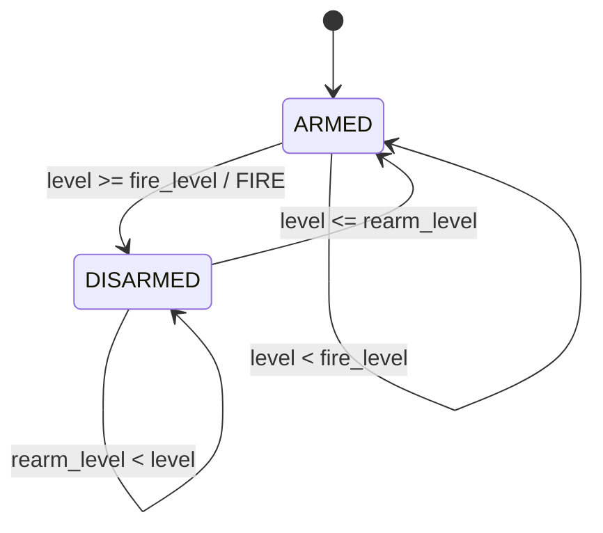
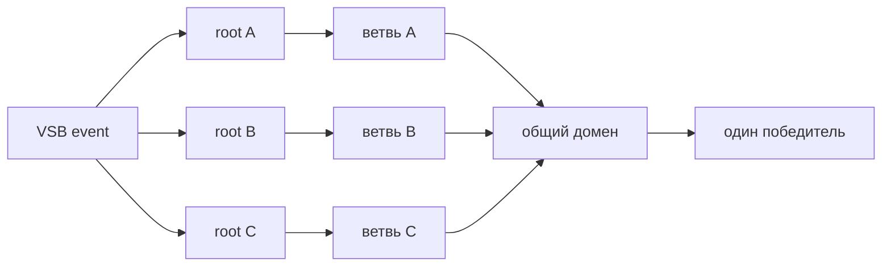

# Паттерны архитектора личности

Личность Decima-8 строится не из программных ветвлений, а из устойчивых
сочетаний входного алфавита, параметров тайлов, локального графа допуска,
доменов и правил сброса. Архитектор использует эти сочетания как строительные
блоки.

Паттерн здесь означает не распознаваемый объект и не `pattern_id`, а
повторяемую схему проектирования органа личности.



## Карточка паттерна

Перед выпечкой для каждого органа фиксируются:

| Поле | Вопрос |
| --- | --- |
| Назначение | Какое событие орган различает? |
| Единицы входа | Что физически означает каждый уровень VSB? |
| Возбуждение | Как орган набирает состояние? |
| Утечка | За какое время прежнее воздействие теряет значение? |
| FIRE | В какой коридор должен войти аккумулятор? |
| Повторный взвод | Когда орган снова имеет право выдать событие? |
| Сброс | Какие домены очищаются после решения? |
| Инварианты | Что обязано оставаться верным на любой допустимой ленте? |

Без этой карточки численные пороги теряют физический смысл и личность
становится зависимой от случайного масштаба входа.

## Интегратор с утечкой

Один unlocked-тайл уже реализует простейший орган памяти:

```text
state <- decay_toward_zero(state + W x VSB)
```

Сильные и частые импульсы накапливаются, редкие следы исчезают. Время памяти
задаётся совместно весами, `decay16` и коридором фиксации. Это не буфер
последних кадров: хранится итог взаимодействия потока с личностью.

Паттерн подходит для давления, частоты повторений и накопленного согласия
нескольких входных линий.

## Коридорный детектор

Тайл выдаёт FIRE не при условии «выше порога», а при входе signed-аккумулятора
в коридор:

```text
thr_lo16 <= state <= thr_hi16
```

Верхняя граница позволяет отличить ожидаемую силу воздействия от перегруза.
Слишком слабый и слишком сильный сигнал могут иметь разный смысл.

Коридор должен проверяться вместе с реальным диапазоном входного алфавита.
Иначе орган либо никогда не откроется, либо будет постоянно находиться в
активной области.

## Порог с гистерезисом

Если непрерывный уровень колеблется возле одного порога, обычный crossing
порождает пачку событий. Для событийного органа используется два уровня:

```text
ARMED:
  level >= fire_level  -> FIRE, перейти в DISARMED

DISARMED:
  level <= rearm_level -> перейти в ARMED

rearm_level < fire_level
```

Это гидравлический аналог триггера Шмитта. Верхний уровень открывает клапан,
нижний снова взводит его. Между ними орган сохраняет состояние и не реагирует
на дребезг.



Гистерезис отличается от debounce:

- не требует таймера;
- не скрывает несколько независимых экскурсий;
- выдаёт ровно одно событие на одно полное прохождение уровня;
- сохраняет физические единицы входа.

Паттерн может быть реализован входным органом Conductor или отдельной
антагонистической группой тайлов. Если преобразование выполнено до VSB, его
`fire_level`, `rearm_level`, единицы и версия алфавита входят в manifest
личности наравне с параметрами `.d8p`.

## Цепочка последовательности

Локальное ребро передаёт потомку разрешение вычисляться, но не данные.
Поэтому цепочка выражает порядок условий:

```text
условие A
  -> разрешить тайл B на следующем такте
  -> условие B
  -> разрешить тайл C
```

Каждый узел слышит новый кадр общей VSB. Такой орган различает развитие
события во времени, а не один составной кадр.

## Параллельный fan-out

Независимые гипотезы нельзя укладывать в одну последовательную магистраль.
Короткий импульс успеет открыть только ближайшие ветви, и дальняя часть
каталога станет физически недостижимой.

Для альтернативных ветвей каждый корень получает независимое разрешение:



Геометрическая компактность не важнее временной достижимости. Пекарь обязан
проверить каждый заявленный путь реальным runtime, а не только структурой
файла `.d8p`.

## Схождение и доменная конкуренция

Несколько ветвей могут описывать разные пути к одному классу события. Их
финальные тайлы помещаются в общий домен и получают приоритеты.

Домен:

- объединяет альтернативные объяснения;
- разрешает коллизии детерминированно;
- выдаёт один `pattern_id`;
- может сбросить использованную память через `reset_on_fire_mask16`.

Доменная конкуренция не заменяет доказательство признаков. Она выбирает
победителя среди уже физически достижимых ветвей.

## Согласование масштаба

Одна и та же личность может слушать разные источники только после согласования
их физического диапазона с VSB. Уровень `15` обязан означать сопоставимую силу
воздействия, а не случайный максимум конкретного файла.

Для каждого входного контура фиксируются:

- единицы исходной величины;
- deadband;
- полный диапазон Level16;
- уровни FIRE и повторного взвода;
- причинное окно, если оно используется;
- версия преобразователя.

Коэффициент усиления может различаться между источниками, но остаётся
замороженным внутри проверяемого контура. Иначе меняется не только вход, но и
сама исполняемая личность.

## Обязательная проверка

Новый орган проходит как минимум следующие тесты:

1. Одинаковые вход и начальное состояние дают byte-identical след.
2. Каждый заявленный путь способен привести к своему FIRE.
3. Постоянный уровень выше порога не создаёт повторных crossing-событий.
4. Возврат только в гистерезисную зону не взводит орган.
5. Возврат ниже `rearm_level` разрешает следующее событие.
6. Ни один альтернативный корень не зависит от длины соседней ветви.
7. Сброс очищает только заявленные домены.
8. Масштаб входа записан в manifest и воспроизводится без будущих данных.

Эти проверки относятся к физике личности. Прикладной директор может
интерпретировать готовые события, но не способен исправить глухой,
перевозбуждённый или недостижимый орган.
