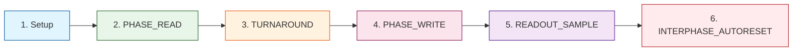

# Фазы READ / WRITE

> **Двухфазный предохранитель: детерминированный ритм Decima-8**

---

## 🔄 Канонический Tick (EV_FLASH)



---

## 1️⃣ Setup (Conductor)

### Действия

```
Conductor выставляет VSB_INGRESS16[0..7] (Level16)
Держит стабильным до конца апертуры READ
```

### Требования

| Требование | Описание |
|------------|----------|
| **Стабильность** | Данные не меняются во время READ |
| **Диапазон** | Level16: 0..15 на каждой линии |
| **Все 8 lane** | Нет per-lane масок |

---

## 2️⃣ PHASE_READ (Island)

### Начало READ

```python
# Снимок locked для всех тайлов
locked_before[t] = locked[t]

# Вычисление ACTIVE closure (least fixed point)
ACTIVE[t] = вычислить по графу активации

# Если ACTIVE[t] == 0 → принудительный сброс
if ACTIVE[t] == 0:
  thr_cur16[t] := 0
  locked[t] := 0
  drive_vec[t] := {0..0}
  # веса/row/decay не применяются
```

### Для ACTIVE[t] == 1

#### Чтение Входа

```python
for i in 0..7:
  in16[t][i] = clamp15(VSB_INGRESS16[i])
  IN_CLIP[t][i] = (VSB_INGRESS16[i] > 15)
```

#### Если locked_before == 0

```python
# 1. Row-pipeline (для каждой строки r=0..7)
row_raw_signed[r] = Σ_{i=0..7} (in16[i] * Wmag[r][i] * sign)
row16_out[r] = clamp15((max(row_raw_signed[r], 0) + 7) / 8)
row16_signed[r] = row_raw_signed[r]

# 2. Аккумулятор + decay
delta_raw = Σ_{r=0..7} row16_signed[r]
thr_tmp = thr_cur16 + delta_raw

# Decay к 0 (не перескакивает)
if decay16 > 0:
  if thr_tmp > 0: thr_tmp = max(thr_tmp - decay16, 0)
  elif thr_tmp < 0: thr_tmp = min(thr_tmp + decay16, 0)

thr_cur16 = clamp_range(thr_tmp, -32768, 32767)

# 3. Фьюз по диапазону
in_range = (thr_lo16 <= thr_cur16 <= thr_hi16) AND (thr_lo16 < thr_hi16)
has_signal = (delta_raw != 0)
entered_by_decay = (decay16 > 0) AND (in_range) AND (!in_range_before_decay)

locked_after = (BAKE_APPLIED == 1) AND in_range AND (has_signal OR entered_by_decay)
```

#### Если locked_before == 1

```python
locked_after := 1
# thr_cur16 не меняется, матрица/decay не применяются
```

#### Выбор Drive Vector

```python
if locked_after == 1:
  drive_vec[i] = in16[i]  # passthrough
else:
  drive_vec[i] = row16_out[i]
```

---

## 3️⃣ TURNAROUND

### Смена Направления

```
Conductor: снимает драйв VSB (Hi-Z / no-drive)
Island: включает драйв BUS16
```

> **Важно:** Обязателен turnaround (зазор направления), чтобы Conductor отпустил VSB и Island мог её драйвить.

---

## 4️⃣ PHASE_WRITE (Island)

### Условия Записи

Тайл пишет в BUS16 только если:

```
BUS_W == 1 AND (locked self OR locked_ancestor)
```

### Запись

```python
# Пишется весь drive_vec[0..7] (все 8 lane)
for t где BUS_W[t]==1 и (locked[t] или locked_ancestor[t]):
  contrib += drive_vec[t]

# Честное суммирование
for i in 0..7:
  BUS16[i] = clamp15(contrib[i])
  BUS_CLIP[i] = (contrib[i] > 15)
```

---

## 5️⃣ READOUT_SAMPLE (Conductor)

### Default R0_RAW_BUS

```python
R0_RAW_BUS: readout = BUS16[0..7] как 8×Level16
```

### Timing

```
Conductor читает BUS16 сразу после завершения PHASE_WRITE этого же EV_FLASH
В SHM: EV_FLASH заполняет OUT_buf, Conductor читает после возврата
```

---

## 6️⃣ INTERPHASE_AUTORESET (Опционально)

### AutoReset-by-Fire

Применяется после фиксации readout и FLAGS32_LAST:

```python
# Вычисление маски авто-сброса
AUTO_RESET_MASK16 = OR_{d | cnt(d)>0} reset_on_fire_mask16[winner(d)]

# Применение
apply_reset_domain(AUTO_RESET_MASK16)
```

### Эффект

```
Для доменов в маске:
  thr_cur16 := 0
  locked := 0

# Кроме тайла-сбрасывателя и цепочки его предков
```

---

## ⏱️ Тайминги (Референс)

| Фаза | Длительность |
|------|--------------|
| **READ** | ~10µs |
| **TURNAROUND** | ~2µs |
| **WRITE** | ~8µs |
| **READOUT** | ~1µs |
| **AUTORESET** | ~1µs |
| **Total** | **~22µs** |

> **Примечание:** Тайминги зависят от реализации (эмулятор/PCB/FPGA/ASIC).

---

## 🚫 Ограничения

| Ограничение | Описание |
|-------------|----------|
| **EV_RESET_DOMAIN** | Только между EV_FLASH |
| **EV_BAKE** | Только между EV_FLASH |
| **BAKE_APPLIED** | EV_FLASH разрешён только если BAKE_APPLIED==1 |
| **Нет изменений baked** | Внутри EV_FLASH baked-параметры не меняются |

---

## 📊 FLAGS32 (Runtime)

Island отдаёт FLAGS32 (минимум):

| Бит | Флаг | Описание |
|-----|------|----------|
| **bit0** | READY_LAST | Последний цикл завершён |
| **bit1** | OVF_ANY_LAST | Переполнение в последнем цикле |
| **bit2** | COLLIDE_ANY_LAST | Коллизия в последнем цикле |

---

**Bake the Future. Build the Substrate.** 🛠️⚡️
