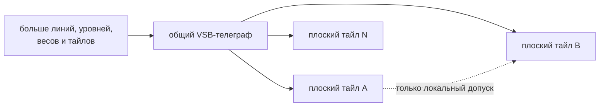

# Модель тайла v3

Тайл — локальный гидравлический интегратор над общей восьмилинейной VSB. Он не получает выход соседа и не пересылает соседу собственные данные.

## Что запекает архитектор

| Поле | Роль |
| --- | --- |
| `W[8][8]` | Signed-преобразование общего VSB-входа |
| `thr_lo16`, `thr_hi16` | Коридор фиксации |
| `decay16` | Утечка аккумулятора к нулю |
| `routing_flags16` | Локальные рёбра разрешения, `BUS_R`, `BUS_W` |
| `domain_id4` | Домен конкуренции и сброса |
| `priority8` | Выбор победителя внутри домена |
| `pattern_id16` | Идентификатор события |
| `reset_on_fire_mask16` | Домены, сбрасываемые победителем |

Runtime-состояние тайла состоит прежде всего из signed-аккумулятора `thr_cur16` и защёлки `locked`.

## Общий вход

Каждый ACTIVE-тайл получает один и тот же кадр:

```c
in16[t][lane] = clamp15(VSB_INGRESS16[lane]);
```

Матрица тайла отвечает не за доставку данных, а за индивидуальную чувствительность к восьми струнам общего потока.

## Граница масштабирования

Восемь линий, Level16, текущая разрядность весов и порогов выбраны осознанно. Это рабочая точка DECIMA-8, а не утверждение, что любая будущая машина обязана навсегда сохранить именно эти размеры.

Архитектура допускает параметрическое расширение:

- больше линий общего VSB;
- больше различимых уровней на линии;
- более широкие веса, пороги и аккумуляторы;
- больше тайлов и доменов.

Такие изменения увеличивают ширину и разрешение машины, но сохраняют её основной контракт: один общий телеграф предъявляет текущий кадр всем ACTIVE-тайлам, каждый тайл обладает только локальным состоянием, а рёбра между тайлами передают разрешение вычисляться, но не значения.



**Глубокий тайл не является таким масштабированием.** Если внутри минимального тайла появляются скрытые слои, собственный тракт передачи значений или последовательность внутренних вычислительных узлов, тайл превращается в маленькую сеть. Сложность переносится из композиции простых элементов общей среды внутрь элемента, меняются его атомарность, причинность и роль архитектора личности.

Такой вариант можно исследовать, но он требует отдельного архитектурного контракта и не считается просто «более крупной DECIMA-8». Иерархию безопаснее строить из явно разделённых плоских контуров, не пряча новую сеть внутри базового тайла.

Физический субстрат сам по себе эту границу не определяет. SRAM, регистровая логика или будущая мемристорная реализация совместимы с Decima, пока сохраняют общий телеграф и модель простого локального интегратора.

## Накопление

Для unlocked-тайла:

```text
delta = sum(W x VSB)
thr_cur = clamp_i16(decay_toward_zero(thr_cur + delta))
```

Если новое состояние попало в активный коридор `[thr_lo16..thr_hi16]`, тайл может защёлкнуться. Переход `unlocked -> locked` образует событие `FIRE`.

Верхняя граница является настоящей частью фильтра. Слишком слабое и слишком сильное накопленное воздействие находятся вне коридора, но смысл этого различия задаёт пекарь, а не сама машина.

## Жизнь locked-тайла

Locked-тайл:

- не добавляет новый `delta`;
- продолжает получать decay к нулю;
- остаётся locked, пока аккумулятор находится в коридоре и сохраняется разрешение активации;
- разблокируется при выходе из коридора или потере разрешения;
- пересчитывает `row_out` из текущего общего VSB для возможного вклада в BUS16.

Следовательно, lock — не вечная метка и не passthrough входа. Это временно удерживаемое состояние с утечкой.

## Эмерджентная память

Последовательность не хранится в отдельном буфере. Она проявляется в совокупности:

1. накопленных `thr_cur`;
2. текущих защёлок;
3. разрешённого фронта топологии;
4. доменных FIRE и reset.

Пекарь формирует орган памяти из небольшого числа тайлов, а лента заполняет его состоянием.

Повторяемые схемы таких органов собраны в разделе
[Паттерны архитектора личности](personality-patterns.md).

Их причинную динамику можно исследовать без IDE в
[WebGL-лаборатории паттернов](../pattern-lab.md): пошагово подать общий VSB,
изменить утечку и сравнить одинаковые органы с разной историей reset.

## Инварианты

- одинаковые `.d8p`, начальное состояние, полная VSB-лента и расписание reset дают одинаковый след;
- `FIRE` означает только переход в lock;
- неактивный тайл принудительно сбрасывает runtime-состояние;
- соседние рёбра не несут данные.
