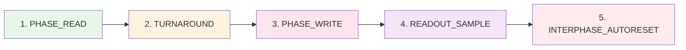

# Протокол v0.2

> **Event Protocol / SHM ABI / UDP**

---

## 📡 Внешние События (API)

### EV_FLASH(tag_u32)

| Параметр | Описание |
|----------|----------|
| **Назначение** | Один детерминированный цикл READ→WRITE |
| **Возврат** | readout (R0/R1), FLAGS читаются отдельно |
| **Условие** | Разрешён только если BAKE_APPLIED==1 |

```python
if BAKE_APPLIED == 0:
  return NotBaked  # состояние не меняется

# Выполняет PHASE_READ → TURNAROUND → PHASE_WRITE → READOUT_SAMPLE
# Заполняет OUT_buf
return readout, FLAGS32
```

---

### EV_RESET_DOMAIN(mask16)

| Параметр | Описание |
|----------|----------|
| **Назначение** | Сброс доменов (thr_cur16=0, locked=0) |
| **Условие** | Только между EV_FLASH |
| **Условие** | Только если BAKE_APPLIED==1 |

```python
if BAKE_APPLIED == 0:
  return NotBaked

for tile in tiles:
  if (mask16 >> domain_id4[tile]) & 1:
    thr_cur16[tile] := 0
    locked[tile] := 0
```

---

### EV_BAKE()

| Параметр | Описание |
|----------|----------|
| **Назначение** | Применение staging BakeBlob атомарно |
| **Условие** | Только между EV_FLASH |
| **Эффект** | Делает reset runtime после применения |

```python
if BAKE_APPLIED == 0:
  return NotBaked

# Применяет staging BakeBlob атомарно
if validation_error:
  return error  # ничего не меняет

# При успехе:
reset_runtime()  # thr_cur16=0, locked=0 для всех
BAKE_APPLIED := 1
```

---

## 🔄 Внутренние Подфазы EV_FLASH



| Подфаза | Описание |
|---------|----------|
| **PHASE_READ** | Тайлы семплируют вход, обновляют runtime |
| **TURNAROUND** | Conductor: Hi-Z, Island: prepare drive |
| **PHASE_WRITE** | Island драйвит BUS16 |
| **READOUT_SAMPLE** | Conductor читает BUS16 |
| **INTERPHASE_AUTORESET** | Опциональный сброс доменов |

---

## 📊 Readout Timing

### Default R0_RAW_BUS

```
Conductor читает BUS16[0..7] сразу после завершения PHASE_WRITE

В SHM: EV_FLASH заполняет OUT_buf
Conductor читает после возврата из вызова
```

### Readout Format

```
readout = BUS16[0..7] как 8×Level16
```

---

## 🚨 Ошибки EV_BAKE

| Ошибка | Код | Описание |
|--------|-----|----------|
| **OK** | 0 | Успех |
| **BakeBadMagic** | 1 | Неверный magic |
| **BakeBadVersion** | 2 | Неверная версия |
| **BakeBadLen** | 3 | Неверная длина |
| **BakeMissingTLV** | 4 | Отсутствует обязательный TLV |
| **BakeBadTLVLen** | 5 | Неверная длина TLV |
| **BakeCRCFail** | 6 | Ошибка CRC |
| **BakeReservedNonZero** | 7 | Reserved поля не нули |
| **TopologyMismatch** | 8 | Несоответствие топологии |
| **BakeNoBlob** | 9 | Blob отсутствует |

---

## 🎛️ Runtime FLAGS32

Island отдаёт FLAGS32 (минимум):

| Бит | Флаг | Описание |
|-----|------|----------|
| **bit0** | READY_LAST | Последний цикл завершён |
| **bit1** | OVF_ANY_LAST | Переполнение в последнем цикле |
| **bit2** | COLLIDE_ANY_LAST | Коллизия в последнем цикле |

---

## 🌐 UDP Protocol (packet_v1)

> **Каскадирование машин**

### Формат Пакета (37 bytes)

| Offset | Поле | Тип | Описание |
|--------|------|-----|----------|
| **0** | magic | u32 | 'D8UP' (0x50553844) |
| **4** | version | u16 | 1 |
| **6** | flags | u16 | has_winner, has_bus, has_cycle, has_flags |
| **8** | frame_tag | u32 | Тег кадра |
| **12** | domain_id | u8 | ID домена |
| **13** | pattern_id | u16 | ID паттерна |
| **15** | reset_mask16 | u16 | Маска сброса |
| **17** | collision_mask16 | u16 | Маска коллизий |
| **19** | winner_tile_id | u16 | ID победителя |
| **21** | cycle_time_us | u32 | Время цикла |
| **25** | flags32_last | u32 | FLAGS последнего цикла |
| **29** | bus16[8] | u8×8 | Значения шины |

### Flags (u16)

| Бит | Флаг | Описание |
|-----|------|----------|
| **bit0** | has_winner | winner_tile_id/pattern_id валидны |
| **bit1** | has_bus | bus16[8] валидны |
| **bit2** | has_cycle | cycle_time_us валиден |
| **bit3** | has_flags | flags32_last валиден |

### Примечания

```
reset_mask16 задаёт домены для RESET_DOMAIN
collision_mask16/winner_tile_id/pattern_id валидны если flags has_winner
bus16 валиден если flags has_bus
cycle_time_us валиден если flags has_cycle
flags32_last валиден если flags has_flags
```

---

## 🎯 COLLIDE: Домены и Winner

### Определения

```
FIRE(t) = (locked_before[t]==0 && locked_after[t]==1)
FIRED_SET(d) = { t | domain_id(t)=d && FIRE(t)=1 }
cnt(d) = |FIRED_SET(d)|
```

### Правила

| cnt(d) | Winner | COLLIDE(d) |
|--------|--------|------------|
| **0** | нет | 0 |
| **1** | единственный | 0 |
| **≥2** | выбирается | 1 |

### Выбор Winner (при cnt≥2)

```
1. max priority8
2. при равенстве min tile_id

winner(d) = argmax_{t∈FIRED_SET(d)} (priority8(t), -tile_id(t))
```

---

## 🔄 AutoReset-by-Fire

### Маска Авто-Reset

```python
AUTO_RESET_MASK16 = OR_{d | cnt(d)>0} reset_on_fire_mask16[winner(d)]
```

### Применение

```
Применяется строго после READOUT_SAMPLE текущего EV_FLASH

apply_reset_domain(AUTO_RESET_MASK16)

Эффект: как 6.3 для доменов в маске, КРОМЕ:
- тайла-сбрасывателя
- всей цепочки его предков
```

---

## 📐 Readout Policy

### Default: R0_RAW_BUS

```
mode = 0
readout = BUS16[0..7]
```

### Опционально: R1_DOMAIN_WINNER_ID32

```
mode = 1
readout = winner_tile_id (требует дисциплины "только winner драйвит ID")
```

> **Примечание:** R1 требует чтобы только winner драйвил ID, иначе сумма разрушит ID.

---

## 📋 Bake Transaction / CFG Staging

### Staging Buffer

```
CFG_CS, CFG_SCLK, CFG_MOSI, CFG_MISO

Через CFG:
- загрузка BakeBlob в staging
- чтение FLAGS
- команда EV_RESET_DOMAIN(mask16)
- (опционально) чтение BAKE_ID_ACTIVE / PROFILE_ID_ACTIVE
```

---

**Bake the Future. Build the Substrate.** 🛠️⚡️
