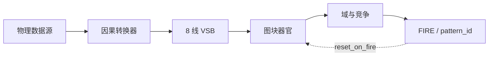
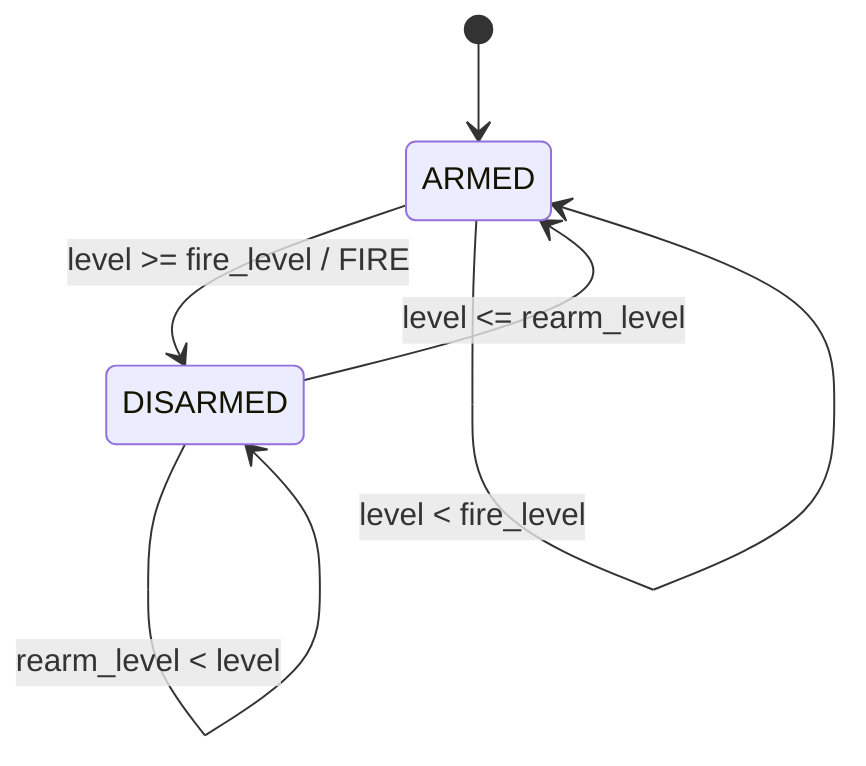
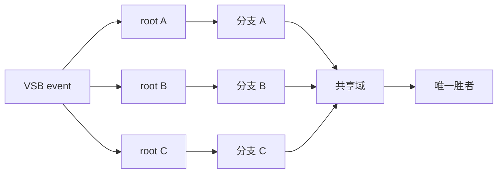

# 人格架构模式

Decima-8 人格由输入字母表、图块参数、局部许可图、域和复位规则的稳定组合构成。
架构师把这些组合作为可复用的构件。这里的“模式”指器官设计方式，而不是识别对象或
`pattern_id`。



## 模式卡

烘焙器官之前，需要记录用途、输入单位、激励、衰减、FIRE 区间、重新武装条件、复位
范围和不变量。缺少这份约定时，数值阈值会失去物理意义。

## 泄漏积分器

一个 unlocked 图块本身就是记忆器官：

```text
state <- decay_toward_zero(state + W x VSB)
```

强脉冲或重复脉冲会积累，稀疏痕迹会消失。记忆时间由权重、`decay16` 和锁存区间共同
决定。

## 区间检测器

当有符号累加器进入区间时，图块产生 FIRE：

```text
thr_lo16 <= state <= thr_hi16
```

上边界可以区分预期强度和过载。两个边界都必须与真实输入字母表的范围一起验证。

## 带迟滞的阈值

连续信号在单一阈值附近波动时会产生事件抖动。事件器官应使用不同的 FIRE 和重新武装
阈值：

```text
ARMED:
  level >= fire_level  -> FIRE，进入 DISARMED

DISARMED:
  level <= rearm_level -> 返回 ARMED

rearm_level < fire_level
```

这是施密特触发器的液压等价物。它不是基于定时器的 debounce：一次完整越界只产生一个
事件。



该模式可以位于 Conductor 输入器官中，也可以由拮抗图块组实现。如果它位于 VSB 之前，
其单位、阈值和字母表版本必须与 `.d8p` 一起写入人格 manifest。

## 序列链

局部边只授予计算许可，不传输数据。因此链条识别的是有序演化：

```text
条件 A -> 下一 tick 启用 B -> 条件 B -> 启用 C
```

每个节点读取公共 VSB 的新一帧。

## 并行 fan-out

独立假设不能共用串行主干。短脉冲可能只打开最近的分支，使目录中的远端分支在物理上
不可达。

每个备选项需要独立许可路径：



烘焙器必须在真实 runtime 中测试每条声明路径，而不能只检查 `.d8p` 结构。

## 汇聚与域竞争

多个解释的终点图块可以共享一个域。优先级确定性地解决冲突，输出一个 `pattern_id`，
并可通过 `reset_on_fire_mask16` 清除已经使用的记忆。

域竞争只能在可达解释之间选择，不能修复缺失的证据路径。

## 尺度匹配

同一个人格只有在不同数据源的物理范围都与 VSB 匹配后才能复用。Level `15` 必须表示
可比较的作用强度，而不是某个文件中的偶然最大值。

每个输入轮廓都要记录源单位、deadband、Level16 满量程、FIRE 和重新武装阈值、因果窗口
以及转换器版本。不同数据源可以使用不同增益，但在可验证轮廓内必须保持冻结。

## 必需验证

1. 相同输入和初始状态产生逐字节一致的轨迹。
2. 每条声明路径都能到达自己的 FIRE。
3. 持续高于阈值不会重复产生 crossing 事件。
4. 只返回迟滞区不会重新武装器官。
5. 返回 `rearm_level` 以下后允许下一个事件。
6. 备选根节点不依赖相邻分支的长度。
7. 复位只清除声明的域。
8. 输入尺度写入 manifest，并且无需未来数据即可复现。

这些检查属于人格物理。应用层 director 可以解释有效事件，但无法修复失聪、饱和或不可达
的器官。
