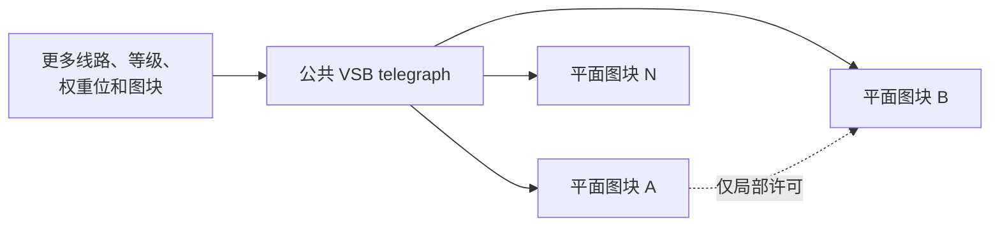

# v3 图块模型

图块是共享八线 VSB 上的局部液压积分器。它既不接收相邻图块的输出，也不把自己的数据转发给相邻图块。

## 架构师烘焙的内容

| 字段 | 作用 |
| --- | --- |
| `W[8][8]` | 对公共 VSB 输入进行有符号变换 |
| `thr_lo16`, `thr_hi16` | 锁存区间 |
| `decay16` | 累加器向零泄漏 |
| `routing_flags16` | 局部许可边、`BUS_R`、`BUS_W` |
| `domain_id4` | 竞争与 reset domain |
| `priority8` | domain 内的 winner 选择 |
| `pattern_id16` | 事件标识符 |
| `reset_on_fire_mask16` | winner 触发 reset 的 domain |

Runtime 状态主要由有符号累加器 `thr_cur16` 和锁存器 `locked` 构成。

## 公共输入

每个 ACTIVE 图块收到相同的帧：

```c
in16[t][lane] = clamp15(VSB_INGRESS16[lane]);
```

图块矩阵不负责传送数据。它定义该图块对公共流八条“弦”的敏感方式。

## 扩展边界

八条线路、Level16，以及当前权重和阈值的位宽，都是有意选择的。它们定义了 DECIMA-8 的工作点，但并不意味着未来的机器必须永久保持完全相同的尺寸。

该架构允许参数化扩展：

- 共享 VSB 使用更多线路；
- 每条线路具有更多可区分的等级；
- 更宽的权重、阈值和累加器；
- 更多图块和 domain。

这些变化提高机器的宽度和分辨率，但保留核心契约：一个公共 telegraph 向所有 ACTIVE 图块呈现当前帧，每个图块只拥有局部状态，相邻边只传递计算许可而不传递数值。



**深层图块不属于这种参数化扩展。** 如果最小图块内部出现隐藏层、私有数值通路或连续的内部计算节点，它就变成了一个小型网络。复杂性从公共介质中简单元素的组合转移到元素内部，从而改变图块的原子性、因果关系以及人格架构师的角色。

这种变体可以作为研究方向，但需要独立的架构契约，不能仅被视为“更大的 DECIMA-8”。若需要层级结构，更清晰的方式是组合边界明确的平面 contour，而不是把另一张网络隐藏在基础图块内部。

物理衬底本身不决定这条边界。SRAM、寄存器逻辑或未来的忆阻器实现都可以承载 Decima，只要保留公共 telegraph 和简单局部积分器模型。

## 累积

对于 unlocked 图块：

```text
delta = sum(W x VSB)
thr_cur = clamp_i16(decay_toward_zero(thr_cur + delta))
```

当新状态进入有效的 `[thr_lo16..thr_hi16]` 区间时，图块可以锁存。`unlocked -> locked` 转换形成 `FIRE` 事件。

上限是过滤器的真实组成部分。积累影响过弱或过强都在区间外，但这种差异的语义由 baker 定义，而不是机器自己定义。

## Locked 图块的生命周期

Locked 图块：

- 不再加入新的 `delta`；
- 继续向零 decay；
- 仅在累加器位于区间内且激活许可仍存在时保持 locked；
- 离开区间或失去许可时 unlock；
- 根据当前公共 VSB 重新计算 `row_out`，用于可能的 BUS16 贡献。

因此 lock 不是永久标记，也不是输入 passthrough，而是一种带泄漏的暂存状态。

## 涌现记忆

序列不存放在独立 buffer 中，而体现在：

1. 已积累的 `thr_cur`；
2. 当前锁存状态；
3. 获得许可的拓扑前沿；
4. domain FIRE 与 reset。

baker 用少量图块构造记忆器官，tape 则把状态写入其中。

## 不变量

- 相同 `.d8p`、初始状态、完整 VSB tape 和 reset 调度产生相同 trace；
- `FIRE` 只表示进入 lock 的转换；
- 非 ACTIVE 图块清除 runtime 状态；
- 相邻边不携带数据。
